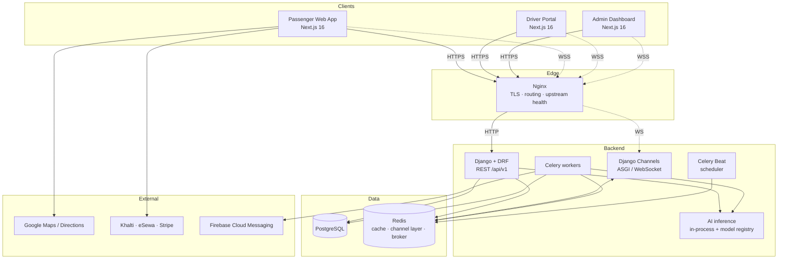
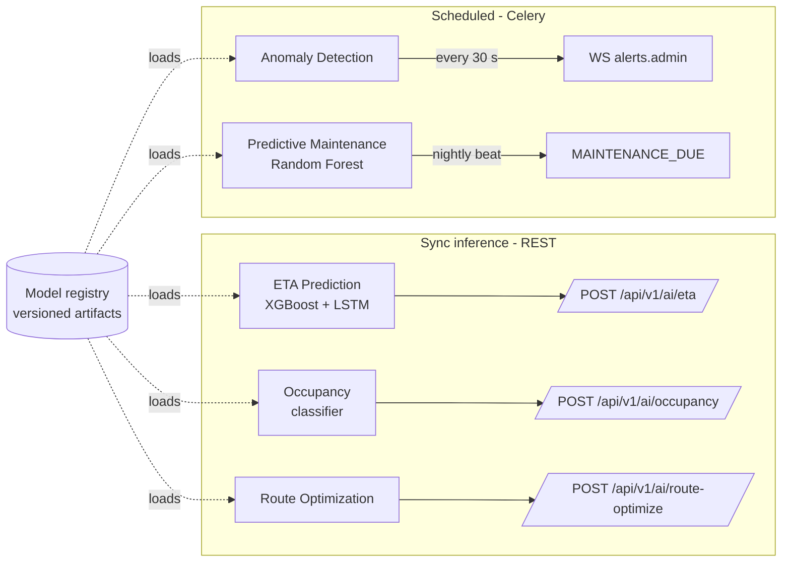
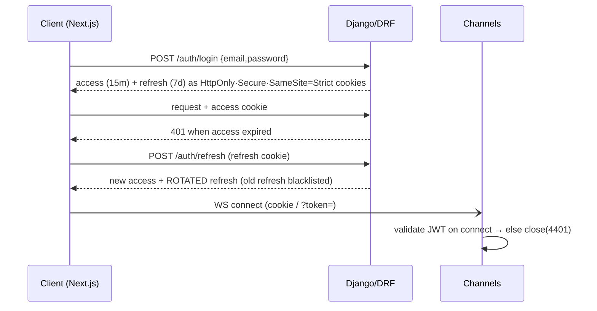
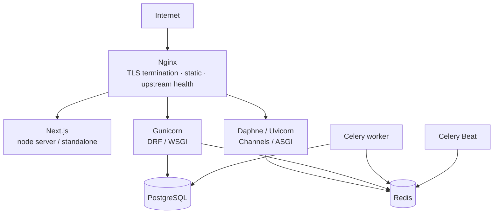

# Architecture — Smart Transit AI

> System topology, the real-time tracking pipeline, AI serving, security model, and
> deployment. This is the source of truth for *how the system is structured*; the
> data model lives in [`er-diagram.md`](er-diagram.md) and the wire contract in
> [`api-contract.md`](api-contract.md).

---

## 1. System context



**One backend, two protocols.** Synchronous request/response goes through DRF over HTTP.
Anything live (driver GPS in, fleet positions out, alerts) goes through Channels over
WebSocket. Both share the same Django ORM, models, and JWT auth. Redis is the connective
tissue: it is the cache, the Channels channel layer (pub/sub), **and** the Celery broker.

### Why this shape

- **Single Django project, multiple DRF apps** (`accounts`, `buses`, `trips`, `tickets`, `notifications`, `analytics`) instead of microservices. The domain is tightly coupled (a trip references a bus, route, and driver; a ticket references a trip) and the team is small — a modular monolith keeps transactions simple and avoids distributed-systems overhead. We can carve out a service later if a clear seam appears (the AI layer is the most likely candidate).
- **Three frontends, one Next.js codebase.** Route groups (`(passenger)`, `(driver)`, `(admin)`) share components, the Axios/Query client, the design system, and types. They differ in layout, role-gating, and which features they import.
- **Redis does three jobs.** Acceptable for early scale; if pub/sub traffic and cache eviction start to interfere, split into two Redis instances (one for the channel layer, one for cache/broker) — this is a config change, not a rewrite.

---

## 2. Frontend architecture

```
frontend/
├── app/
│   ├── (auth)/            # login, register, verify, forgot-password
│   ├── (passenger)/       # search, track, tickets, wallet, profile
│   ├── (driver)/          # trip, navigation, logs, sos
│   ├── (admin)/           # overview, routes, buses, drivers, analytics, monitoring
│   └── api/               # Next route handlers: payment webhooks, BFF proxies
├── components/            # shared ShadCN-based UI
├── features/             # auth, maps, tracking, ticketing, analytics … (vertical slices)
├── hooks/                # useLiveTrip, useSocket, useGeofence …
├── lib/                  # axios client, query client, constants, env
├── store/                # Zustand: socket connection, map view, ephemeral UI
└── types/                # shared TS types (mirror DRF serializers)
```

**Rendering strategy**

- **Server Components by default.** Static and first-paint content (route lists, stop
  details, dashboard shells) render on the server and stream.
- **Client Components only where interactivity demands it:** the live map, the socket
  connection, forms, charts. These are leaf islands inside server-rendered shells.
- **Suspense + streaming** at every data boundary; **skeletons**, never bare spinners.
- **Server Actions** for mutations that don't need optimistic UI (profile edits); TanStack
  Query `mutate` with optimistic updates for interactive ones (save favorite, buy ticket).

**State ownership (strict separation)**

| Concern | Owner |
|---|---|
| Server/async state (routes, trips, tickets) | **TanStack Query** — the only cache for server data |
| Cross-cutting client state (socket status, selected bus, map viewport, theme) | **Zustand** |
| Shallow prop-drilling within a subtree | React Context |
| Form state + validation | TanStack Form + **Zod** schemas (shared with API types) |

**The map is the performance-critical client component** — see §4.

---

## 3. Backend architecture

```
backend/
├── config/             # settings/{base,dev,prod}.py, urls.py, asgi.py, wsgi.py, celery.py
├── apps/
│   ├── accounts/       # custom User, roles, JWT, RBAC permission classes
│   ├── buses/          # buses, routes, bus_stops
│   ├── trips/          # trips, gps_locations, driver_logs
│   ├── tickets/        # tickets, payments, wallet
│   ├── notifications/  # FCM, in-app, email; notification model
│   └── analytics/      # snapshots, report/export endpoints
├── ai_modules/         # eta/, occupancy/, route_optimize/, anomaly/, maintenance/
├── realtime/           # consumers, routing, middleware (JWT auth) — top-level so it
│                        #   doesn't shadow the installed `channels` library
└── celery_tasks/       # async tasks + beat schedule
```

**Layering (Clean Architecture, applied pragmatically)**

```
HTTP/WS  ─▶  DRF View / Consumer  ─▶  Service layer  ─▶  Model / ORM  ─▶  PostgreSQL
                  │                        │
            Serializer (I/O)         Domain logic, transactions, AI calls
```

- **Views/Consumers** are thin: parse, authorize, delegate, serialize. No business logic.
- **Serializers** own input validation and output shaping (the `{data, meta, errors}`
  envelope is applied by a renderer + exception handler, not hand-rolled per view).
- **Service layer** (`apps/<app>/services.py`) owns multi-step domain operations:
  `start_trip()`, `issue_ticket()`, `process_payment_webhook()`. Anything touching more than
  one model or an external system lives here, wrapped in `transaction.atomic()`.
- **Models** hold field definitions, soft-delete manager, and trivial derived properties.

**Cross-cutting backend concerns**

- **Response envelope:** custom DRF renderer wraps success payloads as `{data, meta}`; a
  custom `exception_handler` produces `{errors: [...]}`. Consistent across every endpoint.
- **Soft delete:** abstract `TimeStampedSoftDeleteModel` base (`created_at`, `updated_at`,
  `is_deleted`) + a default manager that filters `is_deleted=False`.
- **Permissions:** role-based DRF permission classes (`IsPassenger`, `IsDriver`, `IsAdmin`,
  `IsOwnerOrAdmin`) on **every** view. No endpoint ships without an explicit permission.
- **Throttling:** DRF `AnonRateThrottle` + scoped `UserRateThrottle` — 100/min passenger,
  300/min driver (GPS-heavy), 500/min admin.
- **Docs:** `drf-spectacular` generates OpenAPI 3 → Swagger UI at `/api/docs/`.

---

## 4. Real-time tracking pipeline

The hardest part of the system and the one the architecture is shaped around. Acceptance
target: **a driver's position is visible to passengers within ≤ 2 s, animated at ≥ 30 fps.**

```mermaid
sequenceDiagram
    participant DRV as Driver Portal
    participant WS as Channels Consumer
    participant RD as Redis channel layer
    participant DB as PostgreSQL
    participant CEL as Celery (anomaly)
    participant PAX as Passenger / Admin map

    Note over DRV: every 3–5 s
    DRV->>WS: {lat,lng,speed,heading,trip_id}  (WSS, JWT verified on connect)
    WS->>WS: validate + rate-limit
    WS-)RD: group_send("trip.<id>", location)
    WS-)RD: group_send("fleet", location)        %% admin overview
    WS->>DB: async buffered write to gps_locations
    RD-->>PAX: location event (fan-out)
    PAX->>PAX: enqueue target; rAF interpolation
    Note over CEL: separate 30 s poll
    CEL->>DB: scan recent gps for deviation/speeding
    CEL-)RD: group_send("alerts.admin", anomaly)
```

**Ingestion (driver → server)**

- Driver client emits every **3–5 s**. The consumer authenticates the JWT **on connect**
  (see §6) and rejects/disconnects unauthenticated sockets.
- Writes to `gps_locations` are **buffered**, not one-row-per-message — batched inserts
  (e.g. flush every N points or M ms) keep write amplification down on a high-frequency table.
- The live broadcast does **not** wait on the DB write; fan-out happens first so latency
  stays low, persistence is best-effort-async.

**Fan-out (server → clients)**

- Two Redis groups per position: `trip.<trip_id>` (passengers watching that bus) and
  `fleet` (admin overview). Passengers subscribe only to trips they're viewing.
- Channels' Redis channel layer handles pub/sub; horizontal scaling = more ASGI workers all
  pointed at the same Redis.

**Client smoothness (the ≥ 30 fps requirement)**

- Incoming positions are **targets**, not immediate jumps. The client keeps the marker's
  current screen position and **linearly interpolates** toward the latest target over the
  emit interval using `requestAnimationFrame`.
- Updates are **debounced/coalesced**: if three positions arrive in a burst, the marker
  animates to the newest, never queuing a backlog of jumps.
- Heading drives marker rotation; polyline for the route is drawn once and cached.

**Reconnection & offline (driver side)**

- WebSocket wrapper with **heartbeat ping/pong** + **exponential backoff** reconnect
  (e.g. 1s, 2s, 4s … capped, with jitter).
- **Offline GPS queue:** while disconnected the driver app buffers coordinates locally
  (IndexedDB) and **flushes in order** on reconnect, so a tunnel or dead-zone doesn't lose
  the trace.
- Background updates via the Page Visibility API / a service worker so positions keep
  flowing when the screen dims.

---

## 5. AI / ML serving

Five modules. They split cleanly into **synchronous inference** (served behind REST) and
**scheduled batch/stream jobs** (Celery).



| Module | Model | Inputs | Output | Trigger |
|---|---|---|---|---|
| **A. ETA** | XGBoost (primary), LSTM (sequential) | time-of-day, historical traffic, weather, route segment, occupancy | arrival time + confidence interval | `POST /ai/eta/` |
| **B. Occupancy** | classifier | route, time, day-of-week, historical load | `LOW \| MEDIUM \| HIGH` | `POST /ai/occupancy/` |
| **C. Route optimization** | ranking/heuristic | live traffic, demand, fuel | ranked alternative routes | `POST /ai/route-optimize/` |
| **D. Anomaly detection** | rules + model | recent `gps_locations` | alert object | Celery poll **30 s** → WS to admin |
| **E. Predictive maintenance** | Random Forest | engine logs, mileage, maintenance history | risk score + recommended service date | Celery Beat **nightly** |

**Serving decisions**

- **Models load once per worker** at startup from a **versioned registry** (artifacts kept
  out of git — see `.gitignore`; loaded from object storage / a mounted volume). No
  per-request disk reads.
- **Inference is synchronous and fast** for A/B/C (tree models predict in microseconds);
  these live in-process behind DRF. If TensorFlow/LSTM latency grows, move ETA to a
  dedicated inference container — the REST contract stays identical.
- **Training is offline.** This repo serves models; a separate training pipeline (notebooks
  + scripts under `ai_modules/<m>/training/`) produces the artifacts. The acceptance target
  (**ETA MAE < 3 min**) is a property of the trained model, validated on a held-out test set.
- **Graceful degradation:** if a model is unavailable, ETA falls back to the Google
  Directions traffic-aware estimate; occupancy falls back to last-known/`MEDIUM`. The UI
  always renders.

---

## 6. Auth & security model



- **JWT:** 15-minute access, 7-day refresh, **refresh rotation** with old-token
  blacklisting (replay protection). **No tokens in `localStorage`** — they live in
  **HttpOnly + Secure + SameSite=Strict** cookies, so client JS can't read them and CSRF is
  constrained.
- **CSRF:** Django CSRF protection on state-mutating endpoints (the `SameSite=Strict`
  cookie + CSRF token double-submit).
- **WebSocket auth:** custom Channels middleware validates the JWT on the `connect` event
  (from cookie or `?token=` query param); failure closes the socket before it joins any
  group.
- **RBAC everywhere:** role enum on `users`; DRF permission class on every view; consumers
  check role before joining `fleet`/`alerts.admin` groups.
- **Transport:** Nginx enforces HTTPS/WSS; Django `SECURE_*` headers (HSTS, secure cookies,
  referrer policy, content-type nosniff).
- **Input safety:** Zod on the frontend, DRF serializer validation on the backend,
  Django ORM only (parameterized queries — **no raw SQL**).
- **Throttling:** per-role rate limits (§3) plus anonymous limits guard auth endpoints.

---

## 7. Deployment topology



- **Docker Compose** for dev (`docker-compose.yml`) and prod (`docker-compose.prod.yml`).
  Services: `nginx`, `frontend`, `web` (Gunicorn/WSGI), `ws` (Daphne/ASGI), `worker`,
  `beat`, `postgres`, `redis`.
- **WSGI and ASGI run as separate processes** behind Nginx — DRF on Gunicorn, Channels on
  Daphne/Uvicorn — routed by path (`/api`, `/ws`).
- **Health checks** on every container; Nginx upstream checks back the **99.5% uptime**
  target. CI (`GitHub Actions`) runs lint + tests + build on every PR.
- **Targets/AWS or DigitalOcean.** Stateless app containers scale horizontally; Postgres and
  Redis are managed services in prod.

---

## 8. How the acceptance criteria map to the design

| Criterion | Where it's satisfied |
|---|---|
| Position visible ≤ 2 s | §4 fan-out-before-persist, Redis pub/sub |
| Marker ≥ 30 fps | §4 rAF interpolation + coalescing |
| p95 < 200 ms core endpoints | §3 thin views + Redis cache + indexes ([er-diagram](er-diagram.md)) |
| ETA MAE < 3 min | §5 offline training + held-out validation |
| 99.5% uptime | §7 health checks + Nginx upstream + horizontal scale |
| No tokens in localStorage / JWT rotation | §6 HttpOnly cookies + refresh rotation |
| Mobile UX @ 375 px | §2 mobile-first Tailwind, Server Components |

---

## 9. Open decisions (to resolve before/within their phase)

1. **Model registry location** — S3/Spaces bucket vs. mounted volume vs. MLflow. *(Phase P5)*
2. **GPS write strategy** — batched ORM insert vs. Redis Stream → periodic drain vs.
   TimescaleDB hypertable if `gps_locations` volume explodes. *(Phase P2; revisit at scale)*
   — **RESOLVED in P2: batched ORM insert.** The driver consumer fans out each point first,
   then buffers and flushes to `gps_locations` via `bulk_create` every `GPS_FLUSH_SIZE` points
   (and on disconnect). Redis Stream / TimescaleDB remain the documented scale-out paths.
3. **Payment gateways** — confirm Khalti + eSewa (Nepal) vs. Stripe (intl) priority for MVP. *(Phase P4)*
4. **Single vs. split Redis** — one instance now; split channel-layer vs. cache/broker if
   contention appears. *(Operational; not blocking)*
5. **Weather data source** for ETA features — provider + caching cadence. *(Phase P5)*
