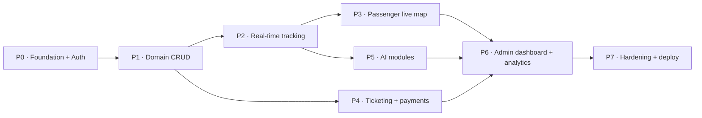

# Build Plan — Smart Transit AI

> A phased delivery plan. Each phase is a coherent, shippable increment that the next
> phase builds on. Phases are ordered by **dependency**, not by app — we go vertical
> (thin end-to-end slices) rather than building all of one app before the next, so the
> risky pieces (real-time, AI serving) get exercised early.

Legend: 🎯 goal · 📦 deliverables · ✅ exit criteria (must pass to call the phase done).

---

## Phasing at a glance

P0 and P1 are strictly sequential foundations. After P2, the **P3 / P4 / P5** tracks can
proceed in parallel (different domains, shared base). P6 integrates them; P7 hardens.

---

## P0 — Foundation & Auth  *(recommended first session)*

🎯 A booting backend + frontend skeleton with working, secure authentication. Nothing
domain-specific yet — but the spine everything hangs off.

📦 Deliverables
- **Backend:** Django 6 project, `config/settings/{base,dev,prod}.py`, ASGI+WSGI entry,
  `drf-spectacular` at `/api/docs/`, custom `User` (email login, `role`), the
  `TimeStampedSoftDeleteModel` base, the `{data,meta,errors}` renderer + exception handler,
  base RBAC permission classes + throttle scopes.
- **Auth:** register, email verify, login, **refresh rotation + blacklist**, logout,
  forgot/reset password, `/auth/me/` — all over **HttpOnly·Secure·SameSite=Strict** cookies.
- **Frontend:** Next.js 16 app, route groups scaffolded, Tailwind v4 + ShadCN, Axios client
  (cookie-aware, 401→refresh interceptor), TanStack Query provider, Zustand setup,
  `(auth)` pages, Next middleware route protection, theme toggle.
- **Infra (dev):** `docker-compose.yml` with `web`, `ws`, `worker`, `beat`, `postgres`,
  `redis`, `frontend`; `.env.example`; GitHub Actions CI (lint + test + build).

✅ Exit criteria
- `docker compose up` → `/api/docs/` loads; register → verify → login → `/auth/me/` works.
- Access expiry triggers a transparent refresh; **no token in `localStorage`** (verify).
- CI green on a PR. Auth unit tests pass (rotation, blacklist, role gating).

---

## P1 — Domain CRUD & reference data

🎯 The static world: routes, stops, buses, drivers — managed and queryable.

📦 Deliverables
- Models + migrations for `routes`, `bus_stops`, `buses`, and driver users; indexes from
  [`er-diagram.md`](er-diagram.md) §4.
- DRF CRUD for admin (`/admin/routes|buses|drivers/…`) with `django-filter` + search +
  cursor pagination; public read endpoints (`/routes/`, `/stops/`).
- Seed/fixtures (a handful of realistic routes, stops, buses) for development.
- Frontend: admin management tables (TanStack Table) + forms (TanStack Form + Zod);
  passenger route/stop browse & search pages.

✅ Exit criteria
- Admin can CRUD routes/stops/buses/drivers; soft delete respected everywhere.
- List endpoints paginate, filter, search, order. Serializer + service unit tests pass.

---

## P2 — Real-time tracking pipeline  *(highest technical risk)*

🎯 Driver GPS in → fan-out to passengers + admin, persisted, within ≤ 2 s. The core of
the product, proven before the UI polish.

📦 Deliverables
- `trips` + `gps_locations` models/migrations; trip start/end + passenger-count endpoints.
- Django Channels: ASGI routing, **JWT-on-connect middleware**, consumers for
  `driver/{trip}`, `trip/{trip}`, `fleet`, `alerts`, `notifications`; Redis channel layer.
- Buffered/batched `gps_locations` writes (fan-out before persist).
- Driver portal: Start/End trip, **GPS stream every 3–5 s**, heartbeat + exponential-backoff
  reconnect, **offline IndexedDB queue + flush** (`/driver/trips/{id}/gps/batch/`),
  background updates (Page Visibility / service worker), SOS button.

✅ Exit criteria
- Measured driver→passenger latency **≤ 2 s**. Socket survives a forced disconnect (queue
  flushes in order). Consumer rejects unauthenticated/forbidden sockets.

---

## P3 — Passenger live map

🎯 The marquee passenger experience: a smooth, animated live map.

📦 Deliverables
- Google Maps integration: colored per-route polylines, tap-to-detail stop markers, user
  location, traffic layer.
- **Animated bus markers** — rAF linear interpolation toward incoming targets, coalesced
  updates, heading-based rotation.
- Geofencing → `BUS_ARRIVING` ("2 stops away"); in-app notification feed + toasts.
- ETA display wired to `/trips/{id}/eta/` (Directions baseline until P5 lands AI ETA).

✅ Exit criteria
- Marker animates at **≥ 30 fps** on a 375 px viewport. Polylines/markers correct. Geofence
  alert fires. No spinner without a skeleton.

---

## P4 — Ticketing, wallet & payments

🎯 Buy a ride. Money correctness + idempotent gateways.

📦 Deliverables
- `tickets`, `payments`, wallet ledger; models/migrations + service layer (`issue_ticket`,
  `process_payment_webhook`, refunds) in `transaction.atomic()`.
- QR generation (signed token), gateway checkout (Khalti/eSewa/Stripe/wallet), **idempotent
  signed webhooks** keyed on `txn_ref`, refund flow.
- Frontend: ticket purchase (optimistic), QR display, wallet + transaction history, refunds.

✅ Exit criteria
- End-to-end purchase issues a valid QR; duplicate webhook is a no-op; refund returns funds;
  `Decimal` money math (no float). Payment-path tests pass.

---

## P5 — AI modules

🎯 Predictions that improve the product: ETA, occupancy, route optimization, anomaly,
maintenance.

📦 Deliverables
- Offline training pipelines (`ai_modules/<m>/training/`) + a versioned model registry
  loaded once per worker.
- REST serving: `/ai/eta/`, `/ai/occupancy/`, `/ai/route-optimize/` with `model_version`
  and **graceful fallbacks**.
- Celery: anomaly poll (30 s → `alerts.admin`), predictive maintenance (nightly →
  `MAINTENANCE_DUE`).
- Frontend: occupancy badge, AI-refined ETA, admin route-suggestion panel.

✅ Exit criteria
- **ETA MAE < 3 min** on a held-out test set. Occupancy classifier reported with metrics.
  Anomalies surface on the admin alert channel within one poll cycle. Fallbacks verified.

---

## P6 — Admin dashboard & analytics

🎯 Operations command center: live fleet, KPIs, analytics, monitoring, exports.

📦 Deliverables
- Live fleet map (`/ws/fleet/`) color-coded by status; KPI cards (`/admin/overview/kpis/`).
- `analytics_snapshots` + Celery rollups; all Recharts views (passengers, buses/hour,
  delays, peak heatmap, revenue, fuel) + virtualized driver leaderboard.
- Monitoring: real-time alert feed (`/ws/alerts/`), incident log with severity badges,
  deviation/overspeed notifications, AI suggestions panel.
- Exports: PDF / CSV / Excel for any report.

✅ Exit criteria
- Fleet map updates live; KPIs match source data; every chart renders from snapshots;
  exports produce valid files; alerts arrive in real time.

---

## P7 — Hardening, security & deploy

🎯 Production-ready: secure, observed, fast, deployable.

📦 Deliverables
- Security pass against the spec checklist (SECURE_* headers, CSRF, WS auth, RBAC audit,
  throttling, input validation both sides). `docker-compose.prod.yml`, `nginx.conf`
  (HTTPS/WSS, upstream health), CI/CD to AWS/DigitalOcean.
- Performance: index/query review, Redis caching on hot reads, load test core endpoints.
- Observability: health checks, structured logging, error tracking; accessibility (WCAG
  2.1 AA) + mobile (375 px) audit.

✅ Exit criteria (the acceptance table)
- p95 **< 200 ms** on core endpoints; tracking **≤ 2 s**; marker **≥ 30 fps**; ETA MAE
  **< 3 min**; uptime **99.5%** via health checks + Nginx upstream; JWT rotation, no
  localStorage tokens; fully functional at **375 px**.

---

## Acceptance-criteria → phase map

| Criterion | Proven in |
|-----------|-----------|
| Tracking latency ≤ 2 s | P2 |
| Marker ≥ 30 fps | P3 |
| API p95 < 200 ms | P7 (designed in P0/P1) |
| AI ETA MAE < 3 min | P5 |
| Uptime 99.5% | P7 |
| JWT rotation, no localStorage | P0 |
| Mobile UX @ 375 px | P3 (frontend), P7 audit |

## Cross-cutting (every phase, not a separate one)

- **Tests** for business-critical logic (services, auth, payments, AI metrics) — required, not deferred.
- **Docs:** keep `architecture.md` / `er-diagram.md` / `api-contract.md` in sync as the
  source of truth when an implementation decision changes them.
- **No placeholders:** each phase ships working code, not stubs (per the project's output
  requirement).

---

## Suggested first session

**Implement P0.** It unblocks everything, is self-contained, and ends at a verifiable
state (`docker compose up` → register/login/refresh working, CI green). When ready, say
*"start P0"* and we'll scaffold the backend + auth + frontend shell.
